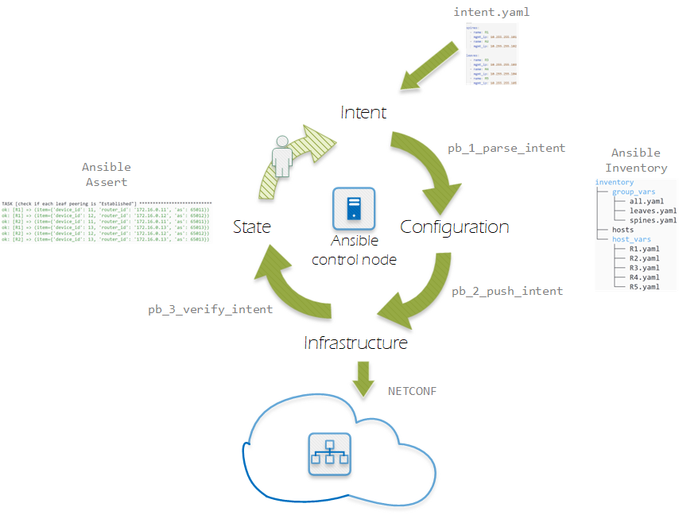
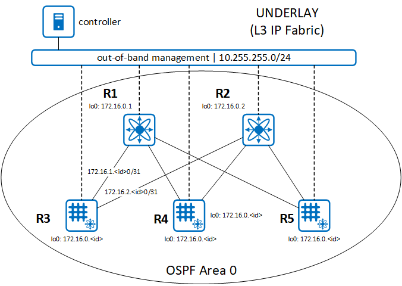

# DIY Intent-based Networking with Ansible

This repo contains code used for the demo in my "DIY IBN" presentation for [NLNOG Day 2022](https://nlnog.net/nlnog-day-2022-the-20th-anniversary-edition/).

## Description
I have build a very bare-bones and simple example for an "Intent Based Network System", just to see if I can and to figure out what components such a system needs. I've tried to keep it as clean as possible, and use only Ansible (with Jinja2 templating) as logic engine.

The IBN System contains these parts:
- Intent: “these are my leaves & spines”
- Configuration: all the messy details.
- Verification: BGP peerings

Graphically, this looks like this:



### Topology
I'm runnning a sample leaf/spine topology with Juniper vQFX switches in a lab:
- IP Fabric with OSPF as underlay
- EBGP for EVPN/VXLAN as overlay



### Preparations
This config is tested with vQFX devices running Junos 17.4R1. The devices need to be reachable over an out-of-band network by the controller. I've used a bare minimum [bootstrap config](device_templates/device_bootstrap_config) for this.

As controller I'm using a simple Linux server with Python 3.8 installed. Prepare the working environment by running the [pb_0_prepare_environment](pb_0_prepare_environment.sh) script.

## Intent process
The IBN process is deliberately not fully automated, to be able to show the various phases in the demo.

### 0. Create intended topology in 'intent.yaml'
looks like:
```
---
spines:
  - name: R1
    mgmt_ip: 10.255.255.101

leaves:
  - name: R3
    mgmt_ip: 10.255.255.103
  - name: R4
    mgmt_ip: 10.255.255.104
```
### 1. Parse intent
This playbook parses intent.yaml to create an ansible inventory

`ansible-playbook -i localhost, pb_1_parse_intent.yaml`

### 2. Push config

This playbook renders config templates according to the intent, and pushes the config to devices.

`ansible-playbook -i inventory pb_2_push_intent.yaml`

### 3. Verify intent
This playbook verifies that BGP peerings are established according to the stated intent.

`ansible-playbook -i inventory pb_3_verify_intent.yaml`
